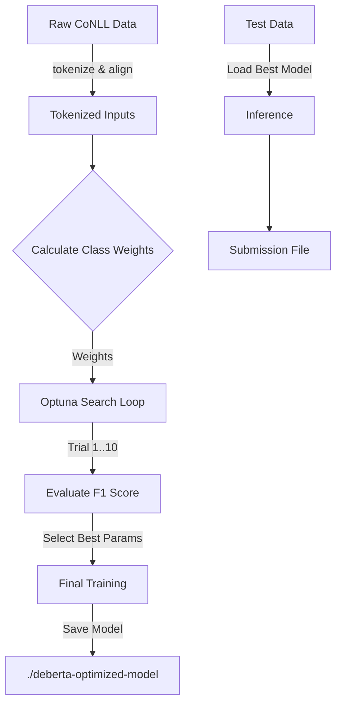

## How It Works


### 1. Data Processing & Alignment
Transformers like DeBERTa use **sub-word tokenization** (e.g., "smartphones" becomes `smart` + `##phones`). However, training labels are provided per whole word.
*   **The Solution**: The `input_data.py` script tokenizes the sentences and aligns the labels.
*   The first sub-token (`smart`) gets the real label (`B-Object`).
*   Subsequent sub-tokens (`##phones`) are assigned a special ID (`-100`), ensuring they are ignored during loss calculation so they don't confuse the model.

### 2. Weighted Loss for Imbalance
In NER datasets, the "O" (Outside) tag often makes up 80-90% of the data. Standard models tend to bias towards predicting "O" to achieve high accuracy, missing the actual entities.
*   **The Logic**: Before training, `get_class_weights` in `train_advanced.py` scans the training set.
*   It calculates **Inverse Class Frequency**: The rarer the tag, the higher the weight.
*   **Manual Boost**: The code explicitly applies a **2x multiplier** to `Aspect` tags. This forces the model to prioritize finding Aspects, penalizing it heavily if it misses them.

### 3. Automated Tuning (Optuna)
Choosing the right Learning Rate (LR) and Batch Size is difficult.
*   Instead of guessing, we use **Optuna**.
*   The script runs **10 trial trainings** with different configurations (e.g., LR between `1e-5` and `5e-5`).
*   It monitors the **F1 Score** on the validation set.
*   The parameters that yield the highest F1 score are selected to train the final model.

### 4. The Model Architecture
We use **DeBERTa V3 (Decoding-enhanced BERT with disentangled attention)**.
*   Unlike standard BERT, DeBERTa handles the relative positions of words better.
*   This is crucial for this task because the relationship between an Object (e.g., "Camera") and its Attribute (e.g., "Quality") often depends heavily on their distance and position in the sentence.

### 5. Pipeline Visualization


## Features

*   **Model**: Uses `microsoft/deberta-v3-large` for contextual embedding and token classification.
*   **Hyperparameter Search**: Integrated **Optuna** backend to automatically find the best learning rate, batch size, weight decay, and epoch count.
*   **Imbalance Handling**: Implements a `WeightedTrainer` that calculates **Inverse Class Frequency** to penalize the model more for missing rare tags (specifically boosting Aspect detection).
*   **robust Data Processing**: Handles CoNLL format data, sub-word tokenization alignment, and sequence evaluation.

## Project Structure

*   `train_advanced.py`: Main training script. Handles class weight calculation, Optuna integration, and the training loop.
*   `predict_.py`: Inference script. Loads the optimized model to generate predictions on test data without labels.
*   `input_data.py`: Utilities for loading CoNLL datasets, tokenizing with DeBERTa, and aligning labels with sub-word tokens.
*   `data_handling.py`: Helper script for reading raw CoNLL files into HuggingFace Dataset objects.

## Installation
Requirements for the code runningg
```bash
pip install -r requirements.txt
```

## Data Format

The project expects data in **CoNLL format** (Tab-Separated Values).

### Training Data (`train.tsv`)
Two columns: `Word` and `Label`.
```text
The	O
camera	B-Object
quality	B-Aspect
is	O
amazing	B-Predicate
```

**Supported Labels:**
*   `O` (Outside)
*   `B-Object`, `I-Object`
*   `B-Aspect`, `I-Aspect`
*   `B-Predicate`, `I-Predicate`

### Test Data (`test_no_answers.tsv`)
One column (or just words separated by newlines/tabs) containing the raw tokens to predict.

## Usage

### 1. Training the Model
To start the training process, run the advanced training script. This will:
1. Load `train.tsv`.
2. Calculate class weights to handle label imbalance.
3. Run an Optuna hyperparameter search (10 trials).
4. Retrain the final model with the best parameters.
5. Save the model to `./deberta-optimized-model`.

```bash
python train_advanced.py
```

### 2. Inference (Prediction)
Once training is complete, generate predictions for your test set. This script reads `test_no_answers.tsv` and generates `submission_deberta.tsv`.

```bash
python predict_.py
```

## Advanced Configuration

### Modifying the Search Space
You can adjust the hyperparameter search space in `train_advanced.py` inside the `hp_space` function:

```python
def hp_space(trial):
    return {
        "learning_rate": trial.suggest_float("learning_rate", 1e-5, 5e-5, log=True),
        "per_device_train_batch_size": trial.suggest_categorical("per_device_train_batch_size", [8, 16]),
        # ... add more parameters here
    }
```

### Custom Class Weights
The model specifically targets improving "Aspect" detection. In `train_advanced.py`, weights are dynamically calculated, but specific classes are manually boosted:

```python
# specific boost for Aspect tags (indices 3 and 4)
weights[3] *= 2.0  
weights[4] *= 2.0  
```

## Metrics
The model is evaluated using the `seqeval` library, focusing on:
*   **Overall F1 Score** (Primary metric for optimization)
*   **Accuracy**

## Output Format
The `predict_.py` script generates a submission file compatible with CoNLL evaluation scripts:

```text
word1    predicted_label
word2    predicted_label
...
```

    # how to use it?
    chmod +x run_pipeline.sh </br>
    ./run_pipeline.sh